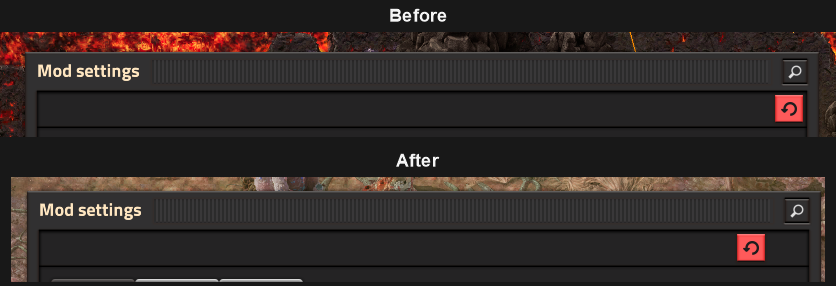

# Reset Button Relocator

Moves Factorio's **Mod Settings** reset button 40 pixels left, creating a clearer gap between it and the search control.

## Compatibility

- Factorio base mod `2.0.77` or later
- Initial release: `0.0.1`

## Install from source

1. Run `powershell -ExecutionPolicy Bypass -File scripts/package.ps1`.
2. Copy `dist/reset-button-relocator_0.0.1.zip` into your Factorio `mods` directory.
3. Enable **Reset Button Relocator** and restart Factorio.

## Implementation note

Factorio does not expose a style unique to the native Mod Settings reset button. The working implementation adds a 40-pixel trailing margin to the shared `tool_button_red` style, moving the reset button a modest distance left.

> **Known side effect:** Any base-game or mod GUI using `tool_button_red` receives the same 40-pixel spacing adjustment. Other red buttons may therefore shift slightly or affect neighboring layout. Testing has not revealed the major layout damage caused by larger offsets, but the shared-style limitation still applies.

## Development

The release artifact has the Factorio-required filename `reset-button-relocator_0.0.1.zip`. The source repository intentionally keeps the mod files at its root.

## License

MIT. See [LICENSE](LICENSE).

